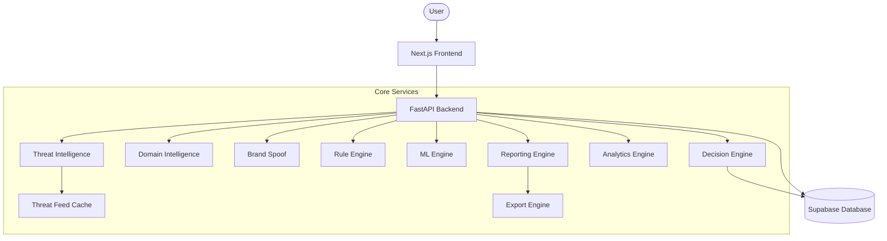
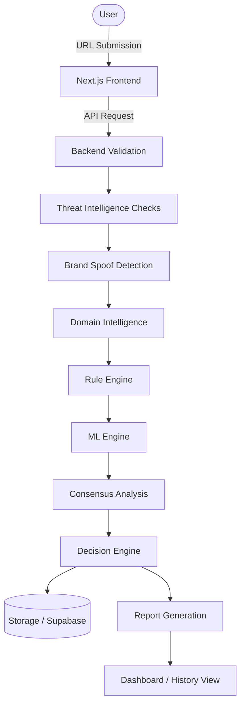
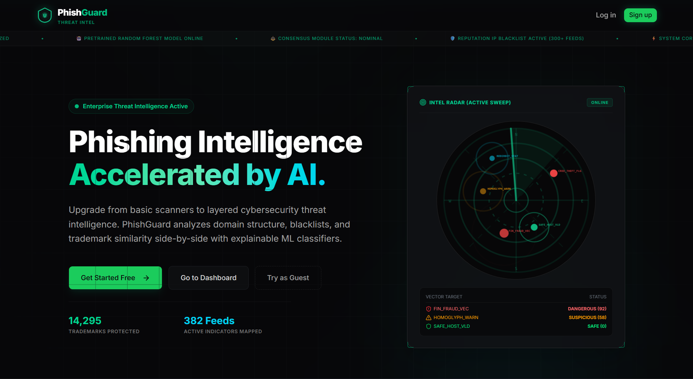
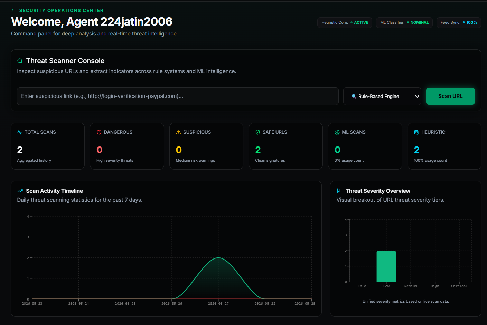
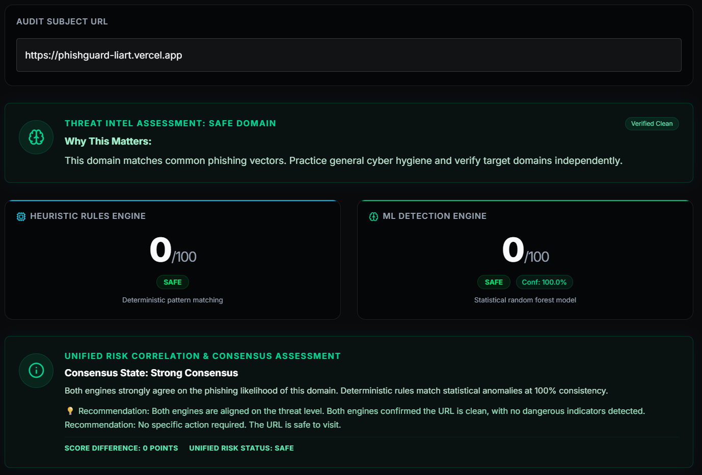
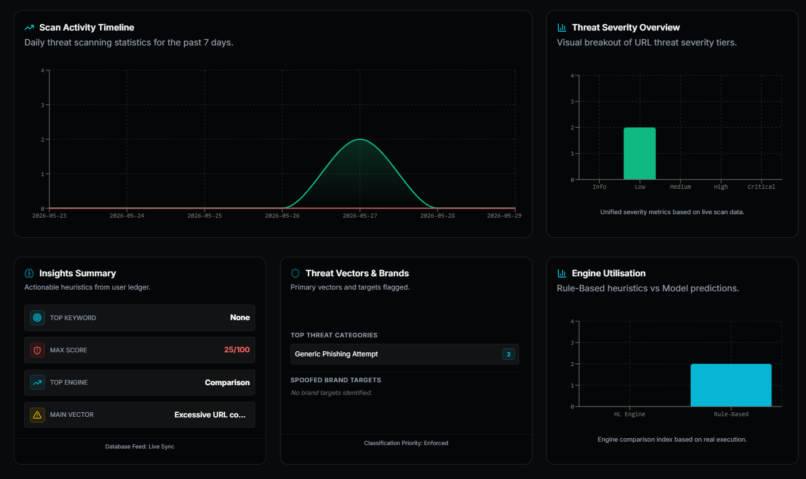
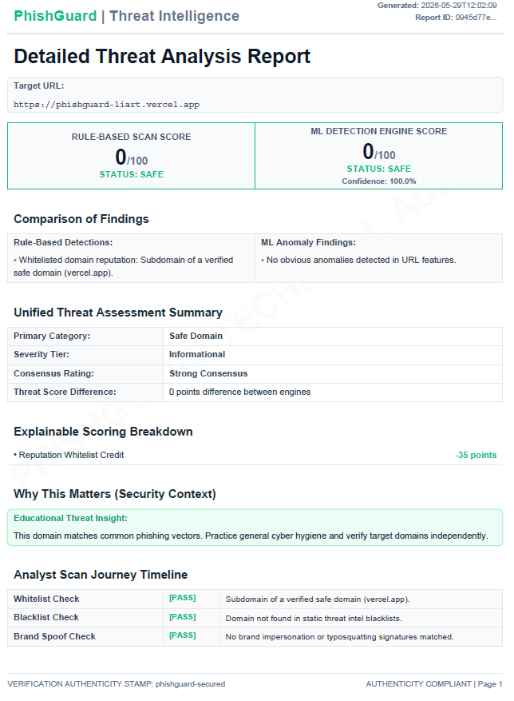
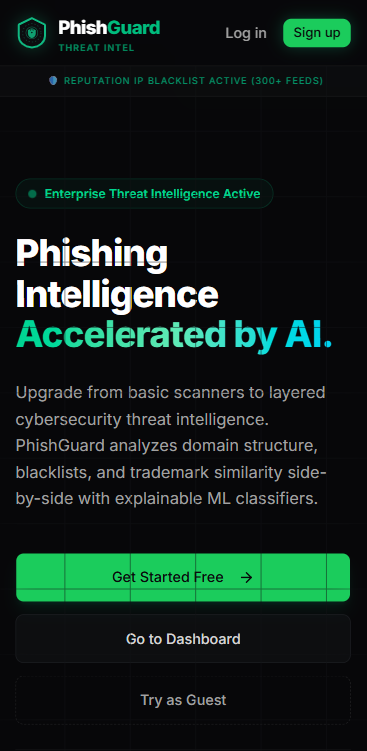

<div align="center">
  <h1>🛡️ PhishGuard</h1>
  <p><strong>Layered Phishing Detection & Explainable Threat Intelligence System</strong></p>
  
  [](https://nextjs.org/)
  [](https://fastapi.tiangolo.com/)
  [](https://supabase.com/)
  [](https://www.typescriptlang.org/)
  [](https://python.org/)
  [](https://developer.mozilla.org/en-US/docs/Web/Progressive_web_apps)
  [](https://opensource.org/licenses/MIT)
  [](#)

  <br />
</div>

---

## 📖 Project Overview

**PhishGuard** is a premium, analyst-grade cybersecurity intelligence platform. It provides deep, explainable analysis of URLs to proactively detect phishing, spoofing, and malicious infrastructure. Moving beyond simple binary blocklists, PhishGuard uses a layered architecture to build a **Consensus Threat Score**, combining heuristic rules, machine learning classifications, and cross-referenced threat intelligence datasets.

Designed with a focus on modern SOC (Security Operations Center) workflows, it offers dynamic visual reporting, exportable PDF forensic audits, and an immersive, tactile Progressive Web App (PWA) experience.

---

## 📈 Project Statistics

* **500,000+** Training Samples
* **RandomForest** Machine Learning Model
* **10+** Extracted URL Features
* **3** Threat Intelligence Sources
* **5** Verdict Levels
* **9** Threat Categories
* **3** Export Formats
* **QR Code** Scanning Support
* **Progressive Web App** (PWA)
* **Analyst-Grade** Reporting System

---

## ⚠️ Threat Classification

PhishGuard dynamically classifies threats into the following hierarchical categories based on intelligence findings, rule triggers, spoof analysis, and threat indicators:

* **Financial Fraud**: Potential impersonation of financial institutions (e.g., PayPal, Chase).
* **Credential Theft**: Mock login portals designed to steal username and password credentials.
* **Brand Spoofing**: Typosquatted domains or homoglyph characters mimicking trusted brands.
* **Malware Delivery**: Structures linked to malware payloads (e.g., `.exe`, `.apk`, suspicious shells).
* **Account Verification Scam**: Fake security warnings urging immediate action to confirm credentials.
* **URL Obfuscation**: Use of raw IP addresses, excessive subdomains, or percent encoding.
* **Suspicious Redirect**: Open redirects bypassing verification screens to forward users.
* **Admin Panel Abuse**: Targeting of administrator consoles (e.g., `wp-admin`, `cpanel`).
* **Newly Registered Domain**: Infrastructure registered very recently with little reputation history.
* **Generic Phishing Attempt**: General behavioral patterns linked to phishing campaigns.

---

## ✨ Key Features

### Authentication & Access
* User Registration
* Login
* Logout
* Protected Routes
* Session Persistence
* Guest Mode

### Detection Engines
* Rule-Based Detection Engine
* RandomForest Machine Learning Engine
* Comparison Engine
* Consensus Analysis
* Decision Engine

### Threat Intelligence
* Whitelist Intelligence
* Blacklist Intelligence
* OpenPhish Integration
* PhishTank Integration
* URLHaus Integration
* Threat Feed Cache
* Threat Feed Synchronization

### Brand Protection
* Brand Spoof Detection
* Homoglyph Detection
* Keyword Imitation Detection
* Trademark Similarity Analysis

### Domain Intelligence
* RDAP Lookup
* WHOIS Fallback
* Domain Age Analysis
* Domain Risk Signals

### User Features
* QR Code URL Scanner
* Manual URL Scanner
* Scan History
* Threat Timeline
* Analytics Dashboard
* Guest History
* PWA Support

### Reporting & Exports
* PDF Reports
* JSON Reports
* TXT Reports
* Executive Summary
* Investigation Timeline
* Supporting Evidence
* Decision Snapshot
* Executive Conclusion

---

## 🚦 Threat Intelligence Sources

PhishGuard integrates dynamic, cross-referenced threat intelligence datasets stored locally for rapid lookups:

### OpenPhish
Community-driven phishing intelligence feed.

### PhishTank
Verified phishing URL repository.

### URLHaus
Malware and malicious infrastructure intelligence feed.

*These feeds are synchronized and cached locally in Supabase to provide zero-latency lookups during the scanning process.*

---

## 🧠 Machine Learning Engine

**Current Model:**
RandomForestClassifier

**Framework:**
scikit-learn

**Detection Features:**
* URL Length
* HTTPS Usage
* Digit Count
* Hyphen Count
* Suspicious Keywords
* Subdomain Count
* Redirect Indicators
* IP Address Usage
* Encoded Characters
* TLD Indicators

**Explainability:**
* Feature Importance Analysis
* Confidence Scoring

### Training Dataset

**Dataset Name:**
Phishing URLs Dataset

**Dataset Source:**
Hugging Face (`ealvaradob/phishing-dataset`)

**Number of Samples:**
500,000+

**Feature Count:**
10+

**Training Approach:**
Offline supervised learning using extracted lexical features, trained and serialized for rapid API inference.

### Current Limitations
* RandomForest is currently the production model.
* Model focuses primarily on lexical URL analysis.
* Does not yet include ASN (Autonomous System Number) intelligence.
* Does not yet include extended domain reputation intelligence.

---

## ⚖️ Decision Engine

PhishGuard does not rely on a single numerical score. The final verdict is generated by combining insights from:

* Threat Intelligence Feeds
* Brand Spoof Detection
* Domain Intelligence
* Rule-Based Engine
* Machine Learning Engine
* Consensus Analysis

### Escalation Logic
The Decision Engine enforces absolute rules based on a strict Verdict Precedence Hierarchy that overrides standard numerical thresholds:

* **Brand Spoof Detection** → Escalates minimum verdict to **SUSPICIOUS**.
* **Brand Spoof + Unregistered Domain** → Escalates minimum verdict to **HIGH RISK**.
* **Financial Brand Spoof** → Escalates minimum verdict to **HIGH RISK**.
* **Threat Feed Match or Blacklisted** → Escalates minimum verdict to **CRITICAL**.
* **Threat Feed + Brand Spoof** → Escalates final verdict to **MALICIOUS** (Highest Precedence).

---

## 🛡️ Verdict Levels

Verdicts are produced through Decision Engine escalation and not only numerical scores.

* **SAFE**
  No significant phishing indicators detected. The domain appears legitimate and structurally sound.

* **SUSPICIOUS**
  Minor indicators or a brand spoof detection with low severity detected. Exercise caution.

* **HIGH RISK**
  Strong phishing indicators detected (e.g., Financial Brand Spoofing or Unregistered Domains). Avoid entering credentials.

* **CRITICAL**
  Multiple intelligence layers indicate malicious behavior, including active threat feed matches.

* **MALICIOUS**
  Known malicious infrastructure actively spoofing a trusted brand. Severe multi-layer evidence confirmed.

---

## 🔢 Threat Scoring Methodology

While the Decision Engine can escalate verdicts beyond numerical boundaries, the baseline severity ranges are evaluated out of 100:

* **0 – 34**
  Safe / Informational
* **35 – 69**
  Suspicious / Low to Medium Risk
* **70 – 84**
  Dangerous / High Risk
* **85 – 100**
  Critical / Malicious

### Contributing Factors:
* Rule Engine heuristics
* Threat Feed Matches (+50 to +60 points per feed)
* Brand Spoof Detection (+25 points)
* Domain Age Signals (+35 points for unregistered active domains)
* Blacklist Indicators
* URL Obfuscation

*Note: Severity scores and the final verdict are intrinsically related, but the Decision Engine's escalation rules guarantee that confirmed threats receive maximum severity regardless of the raw mathematical score.*

---

## 📊 Analytics Dashboard

* Total Scans
* Safe URLs
* Suspicious URLs
* Dangerous URLs
* ML Scans
* Rule-Based Scans
* Average Threat Score
* Threat Distribution
* Timeline Activity
* Engine Usage

These metrics are generated dynamically by aggregating user scan history and global platform telemetry stored in the Supabase PostgreSQL database, presenting operational insights through an interactive Recharts interface.

---

## 🎯 Applications

PhishGuard can be used for:

- Cybersecurity Education
- Threat Intelligence Demonstrations
- Research Paper Prototypes
- Security Awareness Training
- URL Risk Assessment
- Phishing Detection Research

---

## 🚦 Threat Intelligence Pipeline

Input URL
↓
Whitelist Check
↓
Blacklist Check
↓
Threat Feed Intelligence
↓
Brand Spoof Detection
↓
Domain Intelligence
↓
Rule Engine
↓
ML Engine
↓
Consensus Analysis
↓
Decision Engine
↓
Threat Classification
↓
Analyst Report Generation

---

## 🏛️ System Architecture

- **Frontend Layer**: A highly interactive Next.js 16 (React) application utilizing Tailwind CSS and Framer Motion for SOC-grade cinematic visuals. Manages state via Zustand and React Query.
- **Backend Layer**: A high-performance asynchronous REST API powered by FastAPI (Python 3.11). Orchestrates core application logic and route handling.
- **Database Layer**: Supabase PostgreSQL handling authentication, Row-Level Security (RLS), and persistent storage for scan history.
- **Threat Intelligence Layer**: Interrogates external feeds (OpenPhish, PhishTank, URLHaus) and performs real-time WHOIS/RDAP lookups.
- **Detection Engine Layer**: Brand Spoof detection (Homoglyph, Levenshtein), Lexical Rule Engine.
- **ML Engine Layer**: scikit-learn driven inference evaluating extracted URL vectors.
- **Decision Engine Layer**: Evaluates outputs from all upstream intelligence layers to calculate a unified consensus score and verdict.
- **Reporting & Export Layer**: Generates strictly formatted forensic JSON, TXT, and PDF documents (via ReportLab).

### System Architecture Diagram



---

## 🔄 Data Flow



---

## 📸 Screenshots

| Landing Page | Dashboard Overview |
| :---: | :---: |
|  |  |

| Comparison Scan Analysis | Analytics Dashboard |
| :---: | :---: |
|  |  |

| PDF Export Report | Mobile View |
| :---: | :---: |
|  |  |

---

## 🛠️ Tech Stack

**Frontend**
* Next.js 16
* TypeScript
* Tailwind CSS
* ShadCN UI
* Framer Motion
* Zustand
* React Query
* Axios

**Backend**
* FastAPI
* Python
* Pydantic
* scikit-learn
* ReportLab

**Database**
* Supabase Auth
* PostgreSQL

**Deployment**
* Vercel
* Render

---

## 🚀 Installation & Setup

### Prerequisites
- Node.js (v20+)
- Python (v3.10+)
- Supabase Account

### 1. Backend Setup
```bash
cd backend
python -m venv venv
source venv/bin/activate  # On Windows use `venv\Scripts\activate`
pip install -r requirements.txt
cp .env.example .env      # Configure your environment variables
python run.py             # Starts FastAPI server on port 8000
```

### 2. Frontend Setup
```bash
cd frontend
npm install
cp .env.example .env.local  # Configure your environment variables
npm run dev                 # Starts Next.js server on port 3000
```

---

## 🔐 Environment Variables

You must create `.env` files based on the provided `.env.example` templates.

### Frontend (`frontend/.env.local`)
- `NEXT_PUBLIC_SUPABASE_URL`: Your Supabase project URL.
- `NEXT_PUBLIC_SUPABASE_ANON_KEY`: Your Supabase public anonymous key.
- `NEXT_PUBLIC_API_URL`: URL of the FastAPI backend (e.g., `http://localhost:8000`).

### Backend (`backend/.env`)
- `SUPABASE_URL`: Your Supabase project URL.
- `SUPABASE_KEY`: Your Supabase Service Role Key (Keep this secret!).
- `DATABASE_URL`: PostgreSQL connection string.
- `FRONTEND_URL`: URL of the frontend for CORS policy (e.g., `http://localhost:3000`).

---

## 🌍 Deployment

### Vercel (Frontend)
1. Push the repository to GitHub.
2. Import the `frontend/` directory as a new project in Vercel.
3. Add the `NEXT_PUBLIC_*` environment variables.
4. Deploy.

### Render / Railway (Backend)
1. Connect your repository to Render or Railway.
2. Set the Root Directory to `backend/`.
3. Build Command: `pip install -r requirements.txt`
4. Start Command: `uvicorn app.main:app --host 0.0.0.0 --port $PORT`
5. Inject the Backend Environment Variables.

### Supabase (Auth & Database)
1. Run the database migrations/schema setup in the Supabase SQL editor.
2. Ensure Row-Level Security (RLS) is enabled for the `scans` table.

---

## 📱 PWA Support

PhishGuard is built as a fully installable Progressive Web App. 
- **Desktop**: Click the install icon in the URL bar on Chrome/Edge.
- **Mobile**: Tap "Share" > "Add to Home Screen" on iOS Safari, or install via Chrome on Android.
Includes dynamic caching, offline fallback banners, and safe-area inset padding for modern devices.

---

## 📄 Export System

Scan results can be instantly exported for forensic auditing or compliance filing:
- **PDF**: Generates a strictly formatted, multi-page document featuring severity colors, timeline logs, and an authenticity watermark.
- **JSON**: Machine-readable format for API integrations.
- **TXT**: Lightweight text format for quick sharing.

---

## 📍 Current Project Status

**Current Level:**
Advanced Cybersecurity SaaS Prototype

**Completed:**
* QR Scanner
* Threat Intelligence Feeds
* Domain Intelligence
* Decision Engine
* Analyst Reporting
* Threat Classification
* Brand Spoof Intelligence

**Production Components:**
* Frontend
* Backend
* Database
* Intelligence Layers
* Reporting System

---

## 🔭 Future Roadmap

### High Priority
* **Custom Ensemble Intelligence Model**
  * Components: RandomForest, GradientBoosting, LogisticRegression, Weighted Voting
  * Purpose: Increase detection robustness and reduce false positives.

### Medium Priority
* ASN / Hosting Intelligence
* Domain Reputation Intelligence

### Future Scope
* Browser Extension
* Enterprise Threat Intelligence Expansion
* Advanced Threat Hunting Dashboard
* Real-Time Threat Intelligence Expansion

---

## 📄 License

This project is licensed under the [MIT License](LICENSE).

---

## 🤝 Contributors / Credits

Designed and developed with a focus on modern cybersecurity UX and robust machine learning analysis. 
Contributions, issues, and feature requests are welcome! Feel free to check the [issues page](../../issues).

Please see [CONTRIBUTING.md](CONTRIBUTING.md) for details on our code of conduct, and the process for submitting pull requests to us. For security issues, refer to [SECURITY.md](SECURITY.md).
