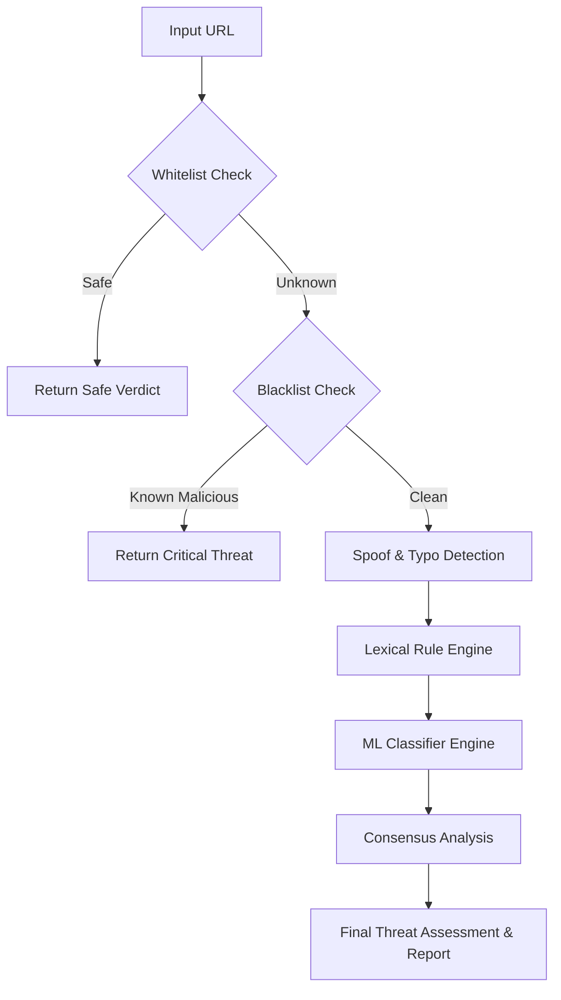

<div align="center">
  <h1>🛡️ PhishGuard</h1>
  <p><strong>Layered Phishing Detection & Explainable Threat Intelligence System</strong></p>
  
  [](https://nextjs.org/)
  [](https://fastapi.tiangolo.com/)
  [](https://supabase.com/)
  [](https://www.typescriptlang.org/)
  [](https://python.org/)
  [](https://developer.mozilla.org/en-US/docs/Web/Progressive_web_apps)
  [](https://opensource.org/licenses/MIT)
  [](#)

  <br />
</div>

---

## 📖 Project Overview

**PhishGuard** is a premium, analyst-grade cybersecurity intelligence platform. It provides deep, explainable analysis of URLs to proactively detect phishing, spoofing, and malicious infrastructure. Moving beyond simple binary blocklists, PhishGuard uses a layered architecture to build a **Consensus Threat Score**, combining heuristic rules, machine learning classifications, and cross-referenced threat intelligence datasets.

Designed with a focus on modern SOC (Security Operations Center) workflows, it offers dynamic visual reporting, exportable PDF forensic audits, and an immersive, tactile Progressive Web App (PWA) experience.

---

## ✨ Key Features

### Threat Intelligence
- **Blacklist Intelligence**: Real-time cross-referencing against known malicious domains.
- **Whitelist Intelligence**: Bypass logic for verified safe domains (e.g., Google, Microsoft).
- **Spoof Detection**: Advanced typo-squatting and homoglyph detection algorithms.
- **Threat Scoring**: Mathematical probability calculation based on indicator severity.
- **Severity Analysis**: Categorization into distinct risk tiers (Critical, High, Medium, Low).

### ML & Analytics
- **ML Detection**: Random Forest classification using passive DNS, WHOIS, and lexical features.
- **Explainable AI**: Transparent indicator breakdown explaining exactly *why* a URL was flagged.
- **Comparison Intelligence**: Side-by-side analysis of a target URL against its purported legitimate counterpart.
- **Analytics Dashboard**: Operational telemetry, recent scans, and timeline histories.
- **Consensus Scoring**: Final unified verdict blending ML outputs and heuristic intelligence.

### Platform Features
- **PWA Support**: Installable on desktop and mobile with native offline handling and safe-area padding.
- **Guest Mode**: Try the platform with temporary session history.
- **Export Engine**: Export compliance-ready reports in PDF, JSON, and TXT formats.
- **Mobile Responsiveness**: Fully responsive dashboard with tactile micro-interactions.

---

## 🚦 Threat Intelligence Pipeline

PhishGuard analyzes URLs through a deterministic, multi-layered pipeline:



*(Alternatively, in text representation:)*
`Whitelist` → `Blacklist` → `Spoof Detection` → `Rule Engine` → `ML Engine` → `Consensus Analysis` → `Final Assessment`

---

## 🏛️ System Architecture

- **Frontend (Next.js 15, App Router, React 19)**: A highly interactive, dark-mode-first React application using Tailwind CSS and Framer Motion for cinematic visual storytelling and SOC aesthetics.
- **Backend (FastAPI, Python 3.11)**: A high-performance asynchronous REST API that orchestrates the threat intelligence engines, machine learning model inference (`scikit-learn`), and report generation (`ReportLab`).
- **Database (Supabase / PostgreSQL)**: Provides robust authentication, Row-Level Security (RLS), and persistent storage for user scan histories and platform analytics.

---

## 📸 Screenshots

| Landing Page | Dashboard Overview |
| :---: | :---: |
|  |  |

| Comparison Scan Analysis | Analytics Dashboard |
| :---: | :---: |
|  |  |

| PDF Export Report | Mobile View |
| :---: | :---: |
|  |  |

---

## 🛠️ Tech Stack

- **Frontend**: Next.js, React, Tailwind CSS, Framer Motion, Zustand, React Query, Recharts, Shadcn UI
- **Backend**: FastAPI, Uvicorn, Python, scikit-learn, ReportLab, Pydantic
- **Auth & DB**: Supabase, PostgreSQL
- **Deployment**: Vercel (Frontend), Render/Railway (Backend)

---

## 🚀 Installation & Setup

### Prerequisites
- Node.js (v20+)
- Python (v3.10+)
- Supabase Account

### 1. Backend Setup
```bash
cd backend
python -m venv venv
source venv/bin/activate  # On Windows use `venv\Scripts\activate`
pip install -r requirements.txt
cp .env.example .env      # Configure your environment variables
python run.py             # Starts FastAPI server on port 8000
```

### 2. Frontend Setup
```bash
cd frontend
npm install
cp .env.example .env.local  # Configure your environment variables
npm run dev                 # Starts Next.js server on port 3000
```

---

## 🔐 Environment Variables

You must create `.env` files based on the provided `.env.example` templates.

### Frontend (`frontend/.env.local`)
- `NEXT_PUBLIC_SUPABASE_URL`: Your Supabase project URL.
- `NEXT_PUBLIC_SUPABASE_ANON_KEY`: Your Supabase public anonymous key.
- `NEXT_PUBLIC_API_URL`: URL of the FastAPI backend (e.g., `http://localhost:8000`).

### Backend (`backend/.env`)
- `SUPABASE_URL`: Your Supabase project URL.
- `SUPABASE_KEY`: Your Supabase Service Role Key (Keep this secret!).
- `DATABASE_URL`: PostgreSQL connection string.
- `FRONTEND_URL`: URL of the frontend for CORS policy (e.g., `http://localhost:3000`).

---

## 🌍 Deployment

### Vercel (Frontend)
1. Push the repository to GitHub.
2. Import the `frontend/` directory as a new project in Vercel.
3. Add the `NEXT_PUBLIC_*` environment variables.
4. Deploy.

### Render / Railway (Backend)
1. Connect your repository to Render or Railway.
2. Set the Root Directory to `backend/`.
3. Build Command: `pip install -r requirements.txt`
4. Start Command: `uvicorn app.main:app --host 0.0.0.0 --port $PORT`
5. Inject the Backend Environment Variables.

### Supabase (Auth & Database)
1. Run the database migrations/schema setup in the Supabase SQL editor.
2. Ensure Row-Level Security (RLS) is enabled for the `scans` table.

---

## 📱 PWA Support

PhishGuard is built as a fully installable Progressive Web App. 
- **Desktop**: Click the install icon in the URL bar on Chrome/Edge.
- **Mobile**: Tap "Share" > "Add to Home Screen" on iOS Safari, or install via Chrome on Android.
Includes dynamic caching, offline fallback banners, and safe-area inset padding for modern devices.

---

## 📄 Export System

Scan results can be instantly exported for forensic auditing or compliance filing:
- **PDF**: Generates a strictly formatted, multi-page document featuring severity colors, timeline logs, and an authenticity watermark.
- **JSON**: Machine-readable format for API integrations.
- **TXT**: Lightweight text format for quick sharing.

---

## 🔭 Future Roadmap

Current Status:
Advanced Cybersecurity SaaS Prototype

Completed:

* QR Scanner
* Threat Intelligence Feeds
* Domain Intelligence
* Decision Engine
* Analyst Reporting

Planned:

* Custom Ensemble Intelligence Model
* ASN / Hosting Intelligence

Future Scope:

* Browser Extension

---

## 🧪 Code Quality

| Metric | Status |
|--------|--------|
| TypeScript Errors | 0 |
| ESLint Errors | 0 |
| ESLint Warnings | 27 (all warnings only, no errors) |
| Build Status | ✅ Passes |
| Test Coverage | Manual integration tested |

---

## 📄 License

This project is licensed under the [MIT License](LICENSE).

---

## 🤝 Contributors / Credits

Designed and developed with a focus on modern cybersecurity UX and robust machine learning analysis. 
Contributions, issues, and feature requests are welcome! Feel free to check the [issues page](../../issues).

Please see [CONTRIBUTING.md](CONTRIBUTING.md) for details on our code of conduct, and the process for submitting pull requests to us. For security issues, refer to [SECURITY.md](SECURITY.md).
